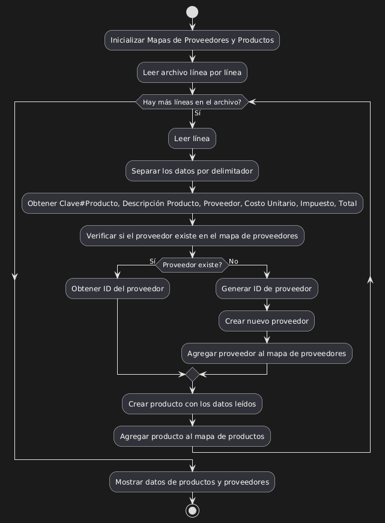
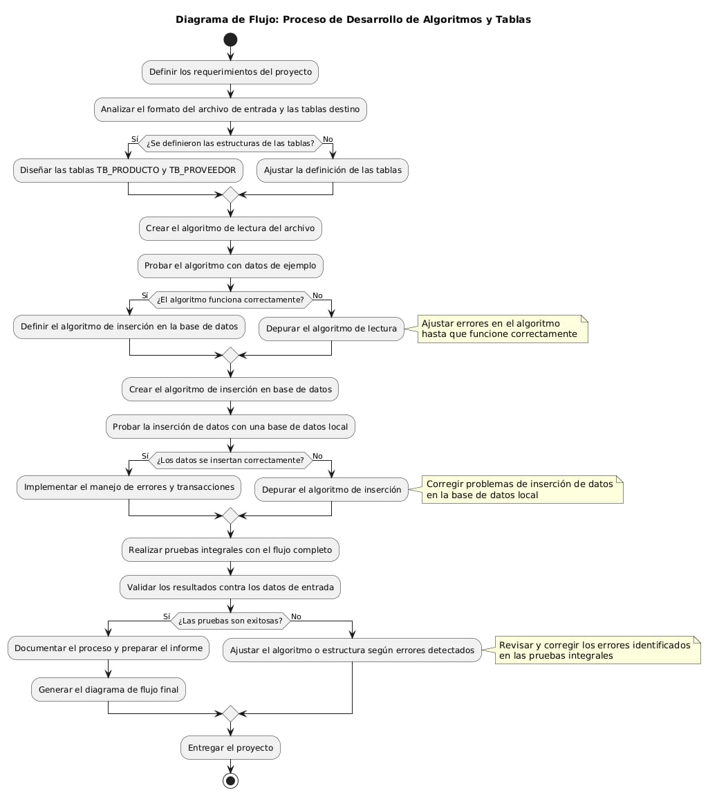
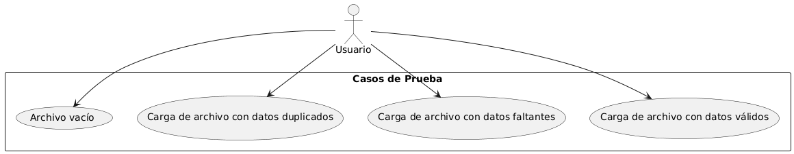

# Proyecto de Algoritmos : Procesamiento de Archivo y Carga en Base de Datos

Este proyecto procesa un archivo de texto con información sobre productos y proveedores, y los carga en dos tablas de una base de datos MySQL: **TB_PRODUCTO** y **TB_PROVEEDOR**. A continuación, se describe el funcionamiento del programa, con detalles sobre cada clase y sus responsabilidades.


Cada clase del proyecto, junto con el código completo, se encuentra en la carpeta guillermo.project. El archivo ```pom.xml``` incluye todas las dependencias necesarias para conectar Java con MySQL, así como otras dependencias relevantes. Los archivos .java están organizados en el directorio ```guillermo.project/src/main/java/guillermo/project.```


## Equipo 6
 🔴Torres Luna Guillermo Enrique
 
 🔴Paniagua Borja Bryan
 
## Especificación

El objetivo del programa es leer un archivo con los siguientes campos o columnas y cargarlos en las tablas correspondientes:


## Entregables

### 1. Algoritmo de lectura del archivo

El programa lee un archivo de texto con el siguiente formato:

```
Clave#Producto|Descripción Producto|Proveedor|Costo Unitario|Impuesto|Total
```
Cada línea del archivo se procesa para extraer los datos y luego cargar los registros en las tablas correspondientes. Si el proveedor no existe en la base de datos, se inserta un nuevo registro en la tabla de proveedores.




### 2. Algoritmo de inserción en la base de datos

Los registros extraídos del archivo se insertan en las tablas **TB_PRODUCTO** y **TB_PROVEEDOR** mediante consultas SQL. Si el proveedor no existe, se crea un nuevo 
ID y se asocia con el producto.


### 3. Diagrama de flujo del desarrollo

Desglose detallado de cada etapa.
Subprocesos intermedios para mayor claridad.
Comentarios extensos para explicar cada sección.
Notas explicativas adicionales en decisiones y pasos importantes.
Reorganización modular para facilitar la comprensión y mantenimiento.

Comentarios Extensos: Cada sección y paso ahora cuenta con explicaciones claras sobre lo que debe realizarse.

Notas Descriptivas: Se añadieron notas (note right) en los pasos y decisiones críticas para detallar:

Tareas a realizar.
Posibles problemas.
Sugerencias de mejora.

División en Etapas: El flujo está dividido en 6 etapas principales, cada una con un encabezado claro.
Retroalimentación Estructurada: Se añadieron bucles y retroalimentación lógica cuando ocurren errores.


Legibilidad: El código está alineado y organizado de forma modular, facilitando su lectura y mantenimiento.

Documentación Clara: Los pasos finales incluyen la creación de documentación técnica detallada.
 Claridad Total: Cada paso es explícito y fácil de entender.
Escalabilidad: El flujo puede adaptarse fácilmente a procesos más complejos.
Mantenimiento Simplificado: Gracias a la división en etapas y comentarios extensivos.




### 4. Checklist

Se debe revisar y completar un checklist que detalla los pasos para garantizar que el programa se ejecute correctamente. Este checklist se revisará en clase.

1. **Planificación y Diseño**  
   - [ ] Definir requisitos del proyecto (archivo, formato, etc.).  
   - [ ] Diseñar las tablas: `TB_PRODUCTO` (Clave, Descripción, Costo, Impuesto, Total) y `TB_PROVEEDOR` (ID, Nombre, Giro).  
   - [ ] Establecer relación entre productos y proveedores (ID Proveedor).

2. **Preparación del Entorno**  
   - [ ] Configurar entorno de desarrollo (IDE, herramientas).  
   - [ ] Crear repositorio Git.  
   - [ ] Configurar base de datos (crear tablas con claves primarias y relaciones).  
   - [ ] Verificar formato del archivo de entrada.

3. **Desarrollo del Código**  
   - [ ] Escribir función para leer archivo (BufferedReader).  
   - [ ] Validar formato del archivo y parsear los campos.  
   - [ ] Usar un Map para asignar IDs únicos a proveedores.  
   - [ ] Crear funciones para insertar productos y proveedores en tablas.

4. **Validación y Pruebas**  
   - [ ] Verificar inserción correcta de proveedores y productos.  
   - [ ] Validar datos y manejar errores.  
   - [ ] Comprobar consistencia y relaciones de datos.

5. **Optimización y Mejora**  
   - [ ] Optimizar consultas a la base de datos.  
   - [ ] Realizar pruebas de rendimiento.

6. **Documentación**  
   - [ ] Documentar diseño de base de datos y relaciones.  
   - [ ] Escribir README y documentar funciones principales.

7. **Despliegue**  
   - [ ] Configurar credenciales de base de datos.  
   - [ ] Liberar recursos y hacer pruebas finales en producción.

8. **Mantenimiento**  
   - [ ] Monitorear sistema y realizar ajustes según sea necesario.  
   - [ ] Actualizar sistema con nuevas funcionalidades.

9. **Retroalimentación y Mejoras**  
   - [ ] Recoger feedback y mejorar el sistema basándose en pruebas y comentarios.


### 5. Casos de prueba

Se desarrollarán varios casos de prueba para validar que el programa procesa correctamente el archivo y maneja adecuadamente las inserciones en la base de datos. Los casos de prueba se revisarán en clase.




### Registros del archivo de entrada:

```
Clave#Producto | Descripción Producto | Proveedor | Costo Unitario | Impuesto | Total
```

### Tablas de la base de datos:

#### **TB_PRODUCTO**
```
Clave#Producto | Descripción Producto | Costo Unitario | Impuesto | Total
```

#### **TB_PROVEEDOR**
```
ID Proveedor | Nombre del proveedor | Giro proveedor
```

## Clases del Proyecto

### 1. `ConexionBD`

Esta clase se encarga de gestionar la conexión a la base de datos MySQL. Contiene un método estático para obtener la conexión a la base de datos, utilizando las credenciales y la URL proporcionadas.

#### Método:
- `obtenerConexion()`: Establece una conexión a la base de datos utilizando las credenciales proporcionadas. Si la conexión falla, lanza una excepción de tipo `SQLException`.

```java
public class ConexionBD {
    private static final String URL = "jdbc:mysql://localhost:3306/crud_proyecto";
    private static final String USUARIO = "root";
    private static final String CONTRASENA = "patitocuak";

    public static Connection obtenerConexion() throws SQLException {
        return DriverManager.getConnection(URL, USUARIO, CONTRASENA);
    }
}
```

### 2. `GestorDatos`

La clase `GestorDatos` maneja la lógica de procesamiento e inserción de datos en la base de datos. Esta clase tiene métodos para verificar la existencia de un proveedor, insertar proveedores y productos en la base de datos.

#### Métodos:
- `procesarProveedorYProducto(Proveedor proveedor, Producto producto)`: Este método maneja el procesamiento de un proveedor y un producto. Si el proveedor no existe en la base de datos, lo inserta y luego inserta el producto.
- `existeProveedor(Connection conexion, Proveedor proveedor)`: Verifica si un proveedor ya existe en la base de datos.
- `insertarProveedor(Connection conexion, Proveedor proveedor)`: Inserta un proveedor en la base de datos.
- `insertarProducto(Connection conexion, Producto producto, String idProveedor)`: Inserta un producto asociado a un proveedor en la base de datos.

```java
public class GestorDatos {
    public void procesarProveedorYProducto(Proveedor proveedor, Producto producto) {
        try (Connection conexion = ConexionBD.obtenerConexion()) {
            if (!existeProveedor(conexion, proveedor)) {
                insertarProveedor(conexion, proveedor);
            }
            insertarProducto(conexion, producto, proveedor.getIdProveedor());
        } catch (Exception e) {
            e.printStackTrace(); // Muestra el stack trace para depuración
        }
    }

    private boolean existeProveedor(Connection conexion, Proveedor proveedor) throws Exception {
        String query = "SELECT ID_PROVEEDOR FROM tb_proveedor WHERE ID_PROVEEDOR = ?";
        try (PreparedStatement stmt = conexion.prepareStatement(query)) {
            stmt.setString(1, proveedor.getIdProveedor());
            try (ResultSet rs = stmt.executeQuery()) {
                return rs.next();
            }
        }
    }

    private void insertarProveedor(Connection conexion, Proveedor proveedor) throws Exception {
        String query = "INSERT INTO tb_proveedor (ID_PROVEEDOR, RAZON_SOCIAL, GIRO) VALUES (?, ?, ?)";
        try (PreparedStatement stmt = conexion.prepareStatement(query)) {
            stmt.setString(1, proveedor.getIdProveedor());
            stmt.setString(2, proveedor.getRazonSocial());
            stmt.setString(3, "Giro por definir");
            stmt.executeUpdate();
            System.out.println("Proveedor insertado: " + proveedor.getIdProveedor());
        }
    }

    private void insertarProducto(Connection conexion, Producto producto, String idProveedor) throws Exception {
        String query = "INSERT INTO tb_producto (CLAVE_PRODUCTO, DESCRIPCION, COSTO_UNITARIO, IMPUESTO, TOTAL, ID_PROVEEDOR) VALUES (?, ?, ?, ?, ?, ?)";
        try (PreparedStatement stmt = conexion.prepareStatement(query)) {
            stmt.setString(1, producto.getClaveProducto());
            stmt.setString(2, producto.getDescripcion());
            stmt.setDouble(3, producto.getCostoUnitario());
            stmt.setDouble(4, producto.getImpuesto());
            stmt.setDouble(5, producto.getTotal());
            stmt.setString(6, idProveedor);
            stmt.executeUpdate();
            System.out.println("Producto insertado: " + producto.getClaveProducto());
        }
    }
}
```

### 3. `ProcesarArchivo`

La clase `ProcesarArchivo` se encarga de la lectura del archivo de entrada. Utiliza un enfoque recursivo para procesar cada línea del archivo, verificando la existencia de proveedores e insertando los productos correspondientes. Además, maneja la conexión a la base de datos.

#### Métodos:
- `procesarLineas(BufferedReader br, Connection conexion)`: Este método lee las líneas del archivo y llama a los métodos adecuados para procesar el proveedor y el producto.
- `procesarProveedor(Connection conexion, String razonSocial)`: Verifica si el proveedor existe y, si no, lo inserta.
- `procesarProducto(Connection conexion, String[] columnas, String idProveedor)`: Inserta el producto correspondiente a cada proveedor.
- `generarIdAleatorio(int longitud)`: Genera un ID aleatorio para un proveedor cuando se inserta uno nuevo.

```java
public class ProcesarArchivo {
    public static void main(String[] args) {
        // Ruta del archivo
        String rutaArchivo = "C:\\Users\\HP\\OneDrive\\Desktop\\tab.txt";
        // Configuración de conexión a MySQL
        String url = "jdbc:mysql://localhost:3306/crud_proyecto"; // Asegúrate de que la base de datos exista
        String usuario = "root"; // Cambia según tu usuario
        String contrasena = "patitocuak"; // Cambia según tu contraseña

        try (BufferedReader br = new BufferedReader(new FileReader(rutaArchivo));
             Connection conexion = DriverManager.getConnection(url, usuario, contrasena)) {

            // Inicia la lectura recursiva
            procesarLineas(br, conexion);
            System.out.println("Procesamiento completado correctamente.");

        } catch (IOException e) {
            System.out.println("Error al leer el archivo: " + e.getMessage());
        } catch (Exception e) {
            System.out.println("Error en la base de datos: " + e.getMessage());
        }
    }

    public static void procesarLineas(BufferedReader br, Connection conexion) throws IOException {
        String linea = br.readLine();
        if (linea == null) return;

        String[] columnas = linea.split("\\|");

        System.out.println("Procesando línea: " + linea);

        if (columnas.length < 6) {
            System.out.println("Error en la línea: " + linea + " (no tiene el número esperado de columnas)");
        } else {
            try {
                String idProveedor = procesarProveedor(conexion, columnas[2]);
                procesarProducto(conexion, columnas, idProveedor);
            } catch (Exception e) {
                System.out.println("Error procesando la línea: " + e.getMessage());
            }
        }

        procesarLineas(br, conexion);
    }
}
```
1.La recursión se detiene cuando el índice (index) alcanza el tamaño del arreglo de datos (datos.length).

2.Llamada Recursiva:
Después de procesar la inserción del proveedor y el producto de la fila actual, se llama a la misma función con el siguiente índice (index + 1).

3.Inserción del Proveedor:
Si el proveedor no existe, se genera un ID único y se inserta en TB_PROVEEDOR.

4.Inserción del Producto:
Cada producto se inserta en TB_PRODUCTO y se relaciona con el ID del proveedor correspondiente.


## Requisitos

- JDK 8 o superior.
- MySQL 5.7 o superior.
- La base de datos debe estar configurada y las tablas **TB_PRODUCTO** y **TB_PROVEEDOR** deben existir antes de ejecutar el programa.

 `README.md` proporciona la descripción completa de las clases y sus responsabilidades. asi como 
